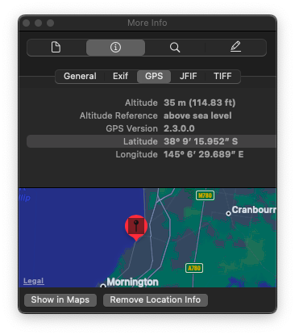

### Title

offtheramp
<br><br>


### Category

Osint
<br><br>


### Description

That looks like a pretty cool place to escape by boat, <br>
EXAMINE<br>
the image and discover the name of the structure <br>
<br><br>


### Solution

1. Download the image attached


2. Check the metadata / EXIF

3. The coordinates are 
```
38° 9 15.952" S
145° 6' 29.689" E
```



4. It's  olivers_hill_boat_ramp
```
DUCTF{olivers_hill_boat_ramp}
```
<br><br>


WHOA !!!
<br><br>


