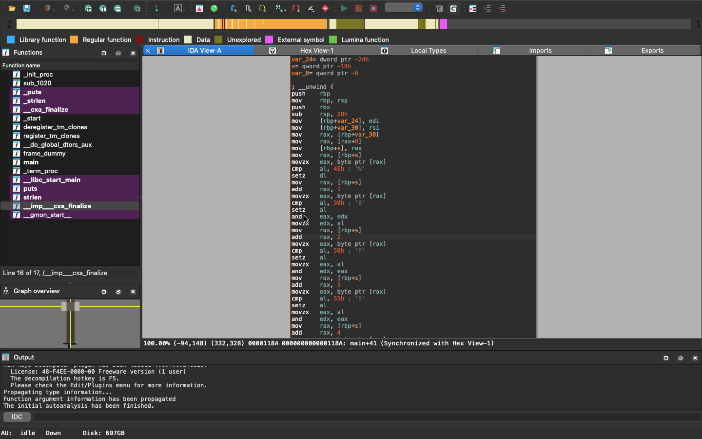
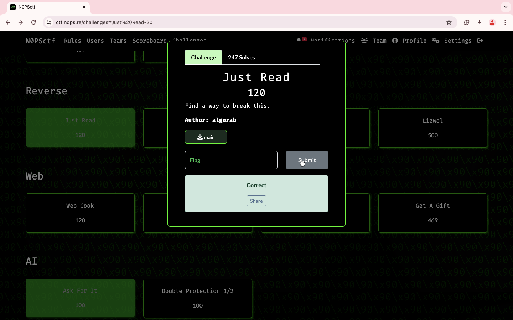

### Title

Just Read
  

### Category

Rev
  

### Description

Find a way to break this. 
  

### Solution

1. Download the binary, Attached. 
2. I have used IDA Pro for reverse engineer
3. Look closely into the comments sections, at every sentence there is one letter comment

4. Concatenate each letter, Finally you get the flag.
  

WHOA !!!
  

