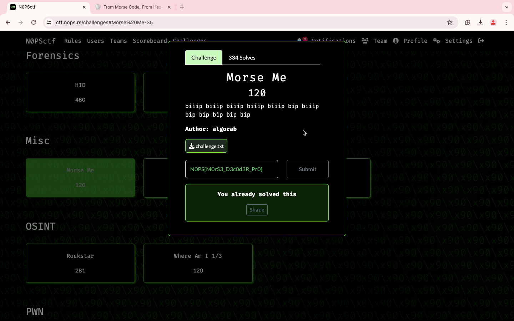

### Title

Morse Me
<br><br>


### Category

Misc
<br><br>


### Description

biiip biiip biiip biiip biiip bip bilip <br>
bip bip bip bip bip
<br><br>


### Solution

1. Copy the content from the challenge.txt
```
....- ...-- -.... ..-. -.... . -.... --... --... ..--- -.... .---- --... ....- --... .- ..--- .---- ..--- ----- ..... ....- -.... ---.. -.... ..... ..--- ----- -.... -.... -.... -.-. -.... .---- -.... --... ..--- ----- -.... ----. --... ...-- ...-- .- ..--- ----- ....- . ...-- ----- ..... ----- ..... ...-- --... -... ....- -.. ...-- ----- --... ..--- ..... ...-- ...-- ...-- ..... ..-. ....- ....- ...-- ...-- -.... ...-- ...-- ----- -.... ....- ...-- ...-- ..... ..--- ..... ..-. ..... ----- --... ..--- ...-- ----- --... -..
```
2. Copy paste in CyberChef, Choose "From Morse Code"
3. It's MOrS3_D3c0d3R_Pr0
```
NOPS{MOrS3_D3c0d3R_Pr0}
```
<br><br>


WHOA !!!
<br><br>

