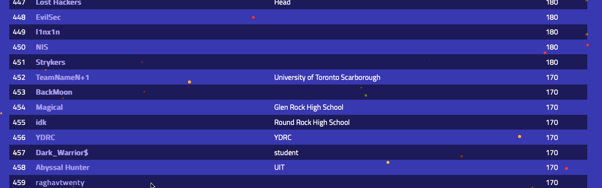
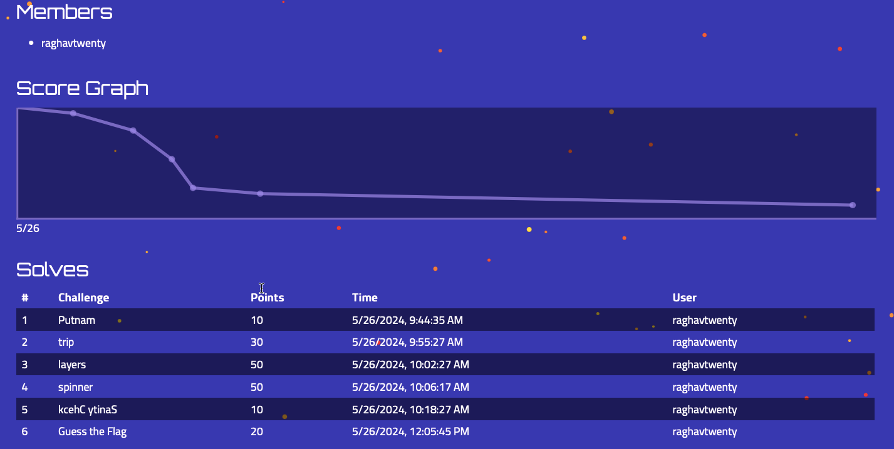

# ANGSTROM CTF 2024

https://2024.angstromctf.com/
   

### 🌟 MILESTONES 🌟

🏆 Ranked 459th place out of 923 participants globally
   

### CTF TIMELINE

Start: 24 May, 2024  
End: 27 May, 2024  
Online
   

### CTF DETAILS

Format: Jeopardy  
Rating weight: 72.06
   

### CHALLENGES

| Challenge     | Category  | Write Up           | Points |
|---------------|-----------|--------------------------|--------|
| Sanity Check   | Misc      | [README](sanity_check/sanity_check.md) | 10    |
| Putnam   | Misc    | [README](putnam/putnam.md) | 10    |
| Trip   | Misc | [README](trip/trip.md) | 30    |
| Layers   | Crypto | [README](layers/layers.md) | 50    |
| Guess The Flag   | Rev | [README](guess_the_flag/guess_the_flag.md) | 20    |
| Spinner   | Web | [README](spinner/spinner.md) | 50    |

  

### MY RANKING

  
### MY SOLUTION

