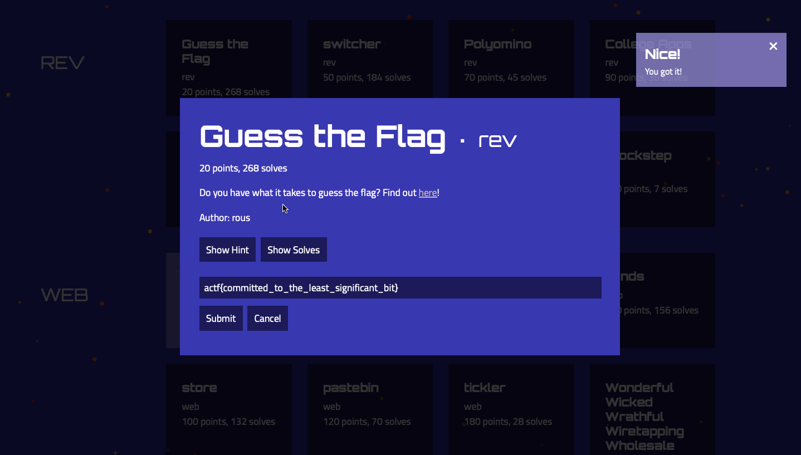

### Title

Guess The Flag
<br><br>


### Category

Rev
<br><br>


### Description

Do you have what it takes to guess the flag? Find out here!
<br><br>


### Solution
1. Download the file
```
https://files.actf.co/b2d1ba18d7fcc3ef5e9c0c09ac07ae7d01519ee5cfb2fdfc8ba88b8e9d7877d6/guess_the_flag
```
2. I have used IDA Pro, You can try any other reverse engineer tool
3. Load the downloaded file
4. Try to understand the logic, I see that it is comparing with user input with some secret code and uses XOR logic
5. Check for the value of secret code variable inside the file
```
`bugzbnllhuude^un^uid^md`ru^md`ru^rhfohgh`ou^ch|
```
7. Copy paste into CyberChef use XOR with key 0x1 (HEX)
```
actf{committed_to_the_least_significant_bit}
```
<br><br>


WHOA !!!
<br><br>

