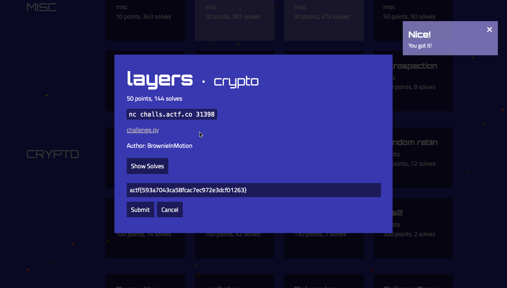

### Title

Layers
<br><br>


### Category

Crypto
<br><br>


### Description

nc challs.actf.co 31398 <br>
challenge.py
<br><br>


### Solution

1. Download the file
```
https://files.actf.co/12a92e8dd8241dac7e9ded2f9435e1573b32aa922b10f694e8c776509cba6461/challenge.py
```
2. Use netcat
```
nc challs.actf.co 31398
```
3. The description says - Surely encrypting multiple times will make it more secure.
4. Choose option 3, To see the flag
```
fb7fdbf9e714a08ce9cdf109bb527acba27accfeff16fcdcbicdf358bb557898aa2d9da9af5c
```
5. I see that it's a HEX message
6. Now, Choose option 2 and paste the above code
7. You get
```
616374667b35393361373034336361353866636163376563393732653364636630313236337d
```
8. One last time, Paste the above result in the CyberChef choose from HEX and you get
```
actf{593a7043ca58fcac7ec972e3dcf01263}
```
<br><br>


WHOA !!!
<br><br>

