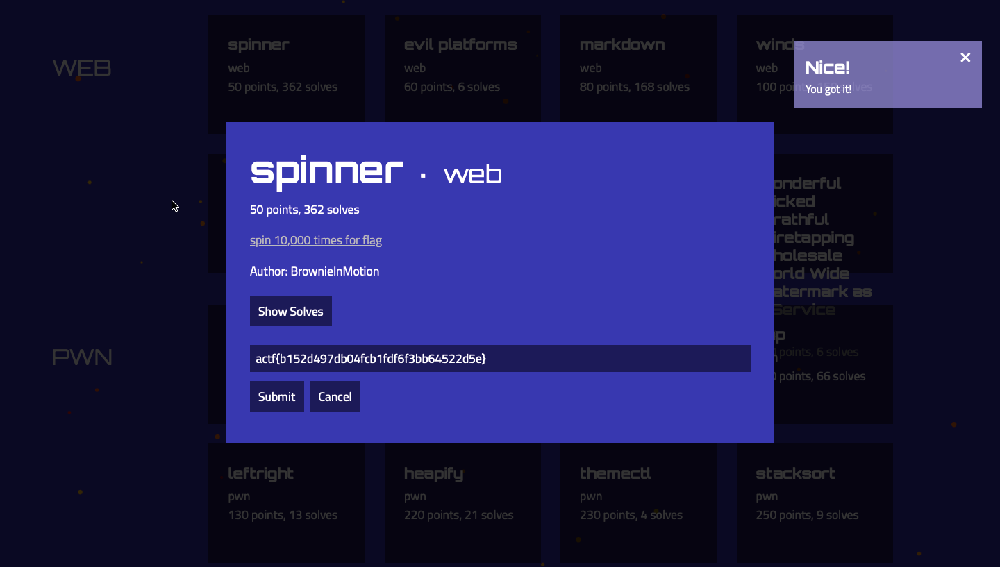

### Title

Spinner
<br><br>


### Category

Web
<br><br>


### Description

spin 10,000 times for flag
<br><br>


### Solution

1. Go to
```
https://spinner.web.actf.co
```
2. Inspect element, I see that it logic is in the client side
3. Look for the variable which is maintaining the count
4. In line 57, I see that _state.value_, _state.total_
5. Now, Go to the console set the value of the state higher than 10000
```
state.total = 1000000
```
6. Spin the circle once, Wait for a second
7. The flag appears in the same window
<br><br>


WHOA !!!
<br><br>

