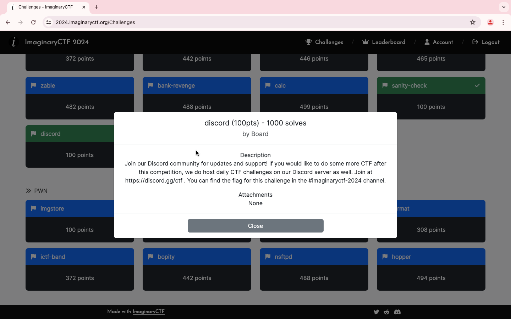
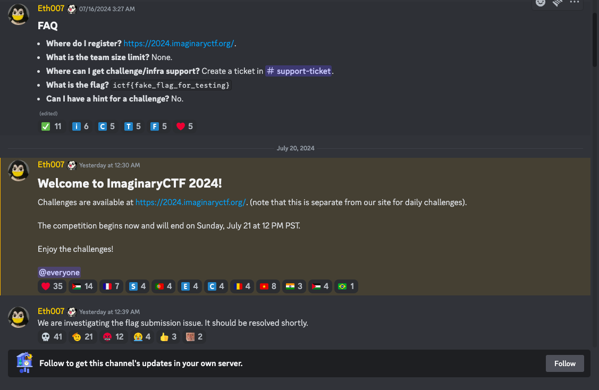
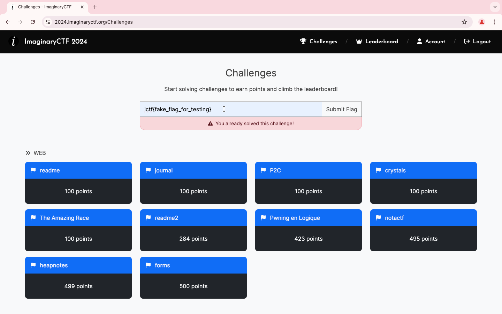

### Title

discord
<br><br>


### Category

Misc
<br><br>


### Description

Join our Discord community for updates and support!  <br>
If you would like to do some more CTF after this competition, <br>
we do host daily CTF challenges on our Discord server as well. <br>
Join at https://discord.gg/ctf . <br>
You can find the flag for this challenge in the #imaginaryctf-2024 channel.
<br><br>


### Solution

1. Go to the discord channel
```
https://discord.gg/ctf
```
2. In the #imaginaryctf-2024  half of the flag can be found





3. It's  fake_flag_for_testing
```
ictf{fake_flag_for_testing}
```
<br><br>


WHOA !!!
<br><br>

