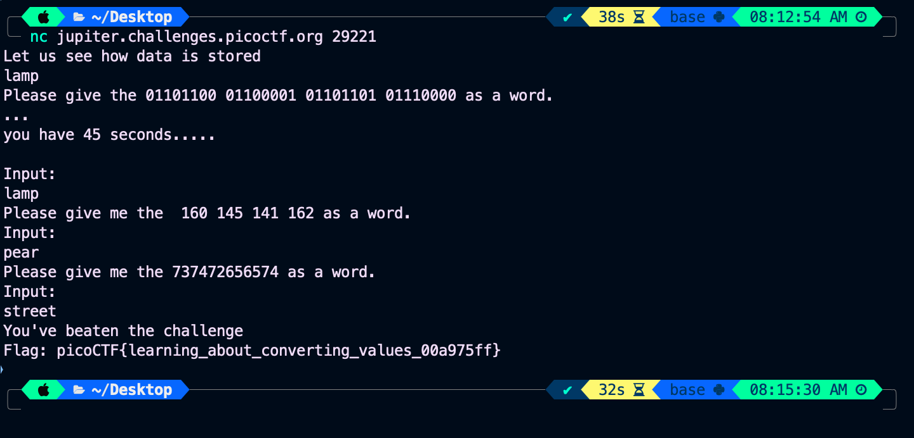
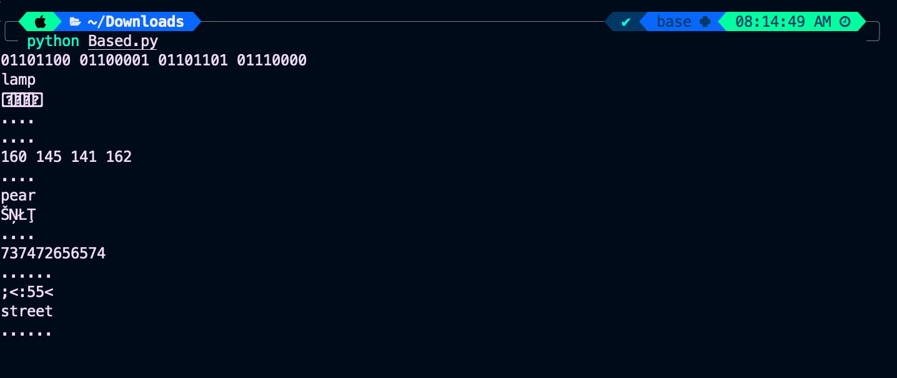

### Title

Based
<br><br>


### Category

General Skills
<br><br>


### Description

To get truly 1337, you must understand different data <br>
encodings, such as hexadecimal or binary. <br>
Can you get the flag from this program to <br>
prove you are on the way to becoming 1337? 
<br><br>


### Solution

1. connect to 

```
nc jupiter.challenges.picoctf.org 29221
```

2. Use the script to decode the code

```
while True:
    n = input()
    s = n.split(' ')
    if len(s) == 1:
        s = []
        for c in range(0, len(n), 2):
            s.append(n[c:c+2])
    for b in [2, 8, 16, 64]:
        for i in range(len(s)):
            try:
                print(chr(int(s[i], b)), end='')
            except:
                print('.', end='')
        print()
```




3. It's  learning_about_converting_values_00a975ff

```
picoCTF{learning_about_converting_values_00a975ff}
```
<br><br>


WHOA !!!
<br><br>

