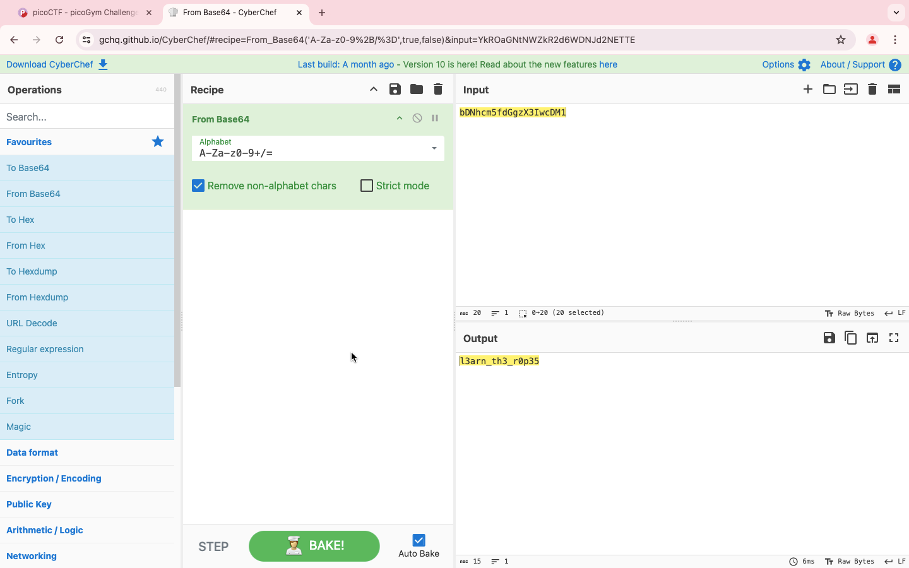
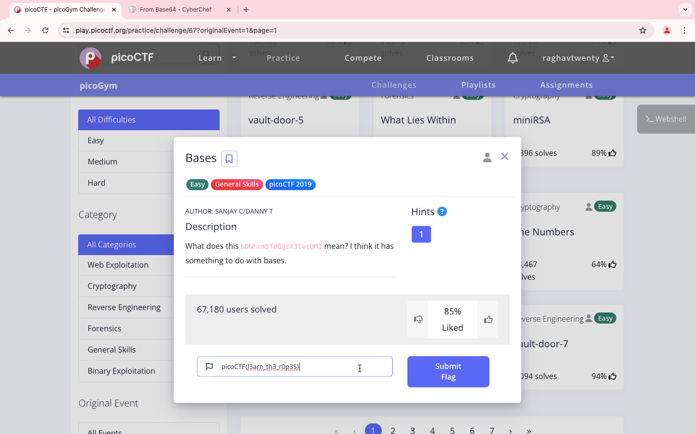

### Title

Bases
<br><br>


### Category

General Skills
<br><br>


### Description

What does this bDNhcm5fdGgzX3IwcDM1 mean? <br>
I think it has something to do with bases.
<br><br>


### Solution

1. Use CyberChef
```
bDNhcm5fdGgzX3IwcDM1
```
2. Choose From Base64



3. It's  l3arn_th3_r0p35
```
picoCTF{l3arn_th3_r0p35}
```
<br><br>


WHOA !!!
<br><br>

