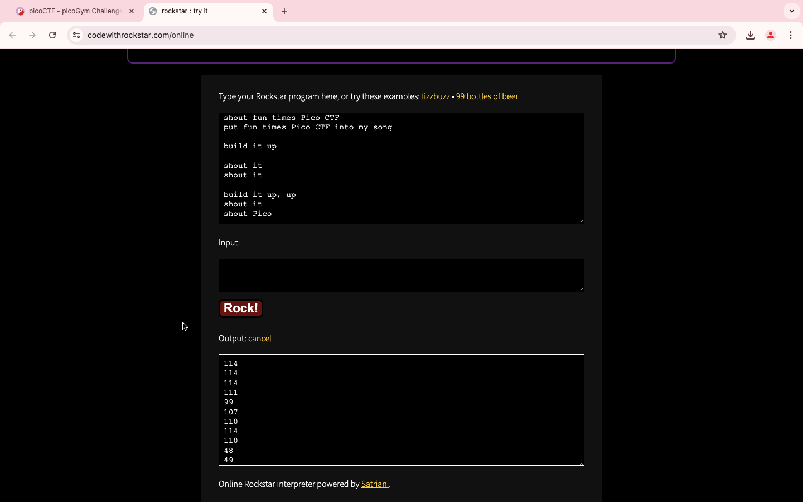
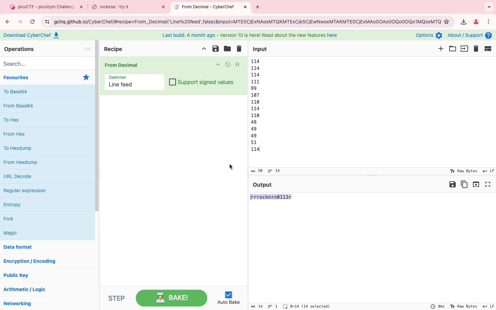

### Title

mus1c
<br><br>


### Category

General Skills
<br><br>


### Description

I wrote you a song. Put it in the picoCTF flag format.
<br><br>


### Solution

1. Copy the entire content in the file attached

2. Paste in the interpreter 

```
codewithrockstar.com/online
```


3. Copy the result from the online interpreter and paste in cyberchef



4. It's rrrocknrn0113r
```
picoCTF{rrrocknrn0113r}
```
<br><br>


WHOA !!!
<br><br>

