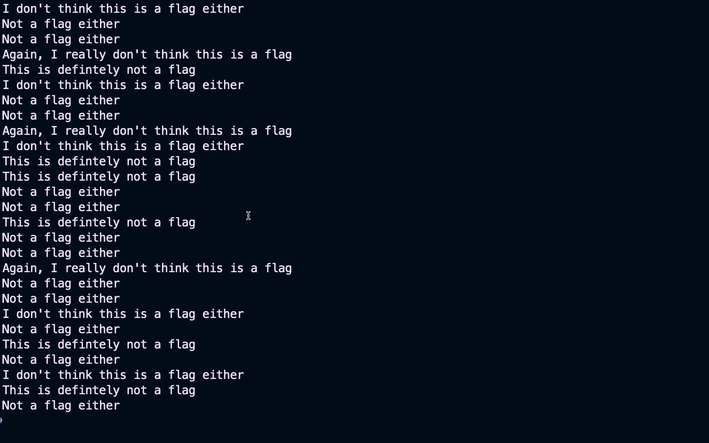
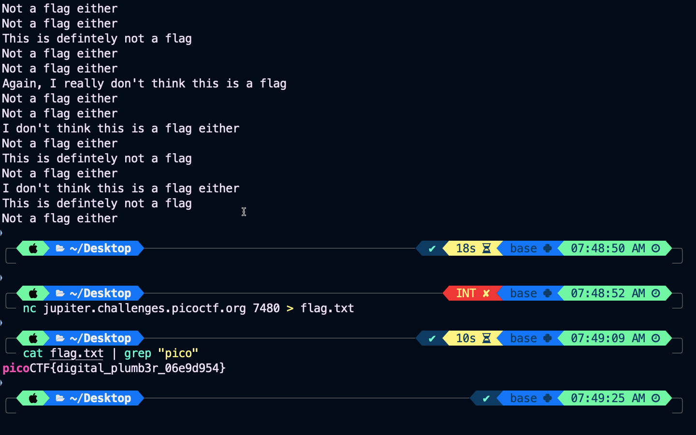
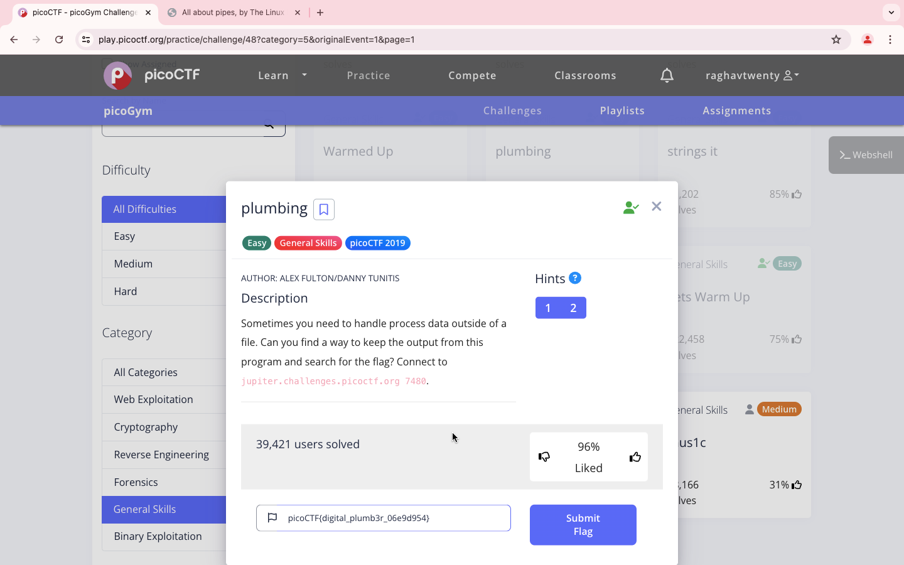

### Title

plumbing
<br><br>


### Category

General Skills
<br><br>


### Description

Sometimes you need to handle process data outside of a file. <br>
Can you find a way to keep the output from this<br>
program and search for the flag?
<br><br>


### Solution

1. Connect to

```
nc jupiter.challenge.picoctf.org 7480
```



2. It will continuously send messages, try using 

```
nc jupiter.challenges.picoctf.org 7480 > flag. txt
```



3. Now use the command to filter the string

```
cat flag.txt | grep "pico"
```

4. It's digital_plumb3r_06e9d954

```
picoCTF{digital_plumb3r_06e9d954}
```
<br><br>


WHOA !!!
<br><br>

