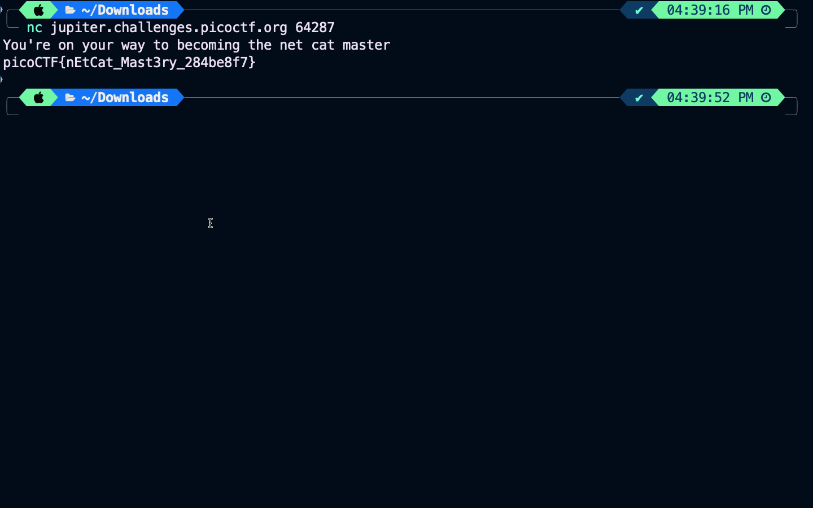

### Title

What's a net cat?
<br><br>


### Category

General Skills
<br><br>


### Description


<br><br>


### Solution

1. Go to terminal and type
```
nc jupiter.challenges.picoctf.org 64287
```



2. Its nEtCatMast3ry_284be8f7
```
picoCTF{nEtCatMast3ry_284be8f7}
```
<br><br>


WHOA !!!
<br><br>

