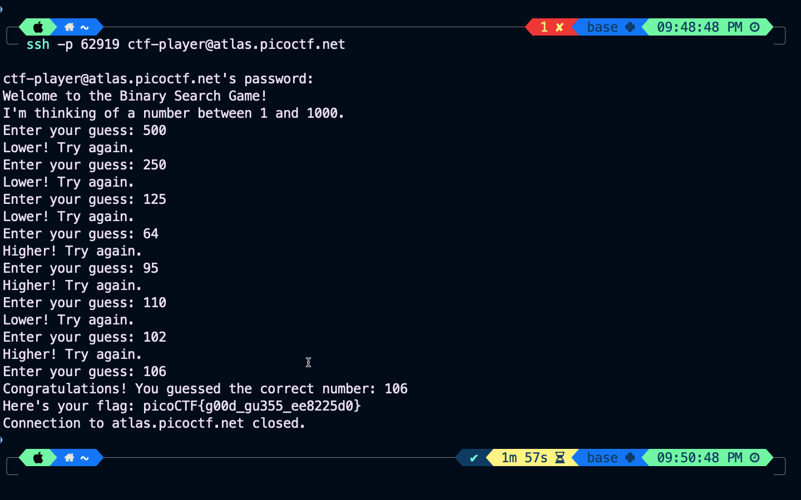
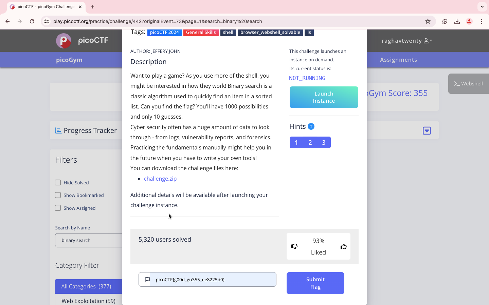

### Points

100

<br>

### Description

Want to play a game? As you use more of the shell, you might be interested in how they work! Binary search is a classic algorithm used to quickly find an item in a sorted list. Can you find the flag? You'll have 1000 possibilities and only 10 guesses.
Cyber security often has a huge amount of data to look through - from logs, vulnerability reports, and forensics. Practicing the fundamentals manually might help you in the future when you have to write your own tools!
You can download the challenge files here:
```
https://artifacts.picoctf.net/c_atlas/4/challenge.zip
```

<br>

### Solution

1. Download the code and understand the logic, It's Binary Search

2. ssh the server, password is in the PicoCTF website
```
ssh -p 62919 ctf-player@atlas.picoctf.net
```

3. Start with input number 500 and keep going with the middle number, based on the hint given.


```
picoCTF{g00d_gu355_ee8225d0}
```

<br>

WHOA !!!

<br>

