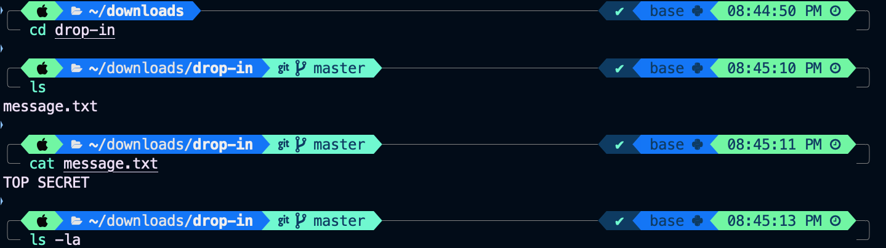
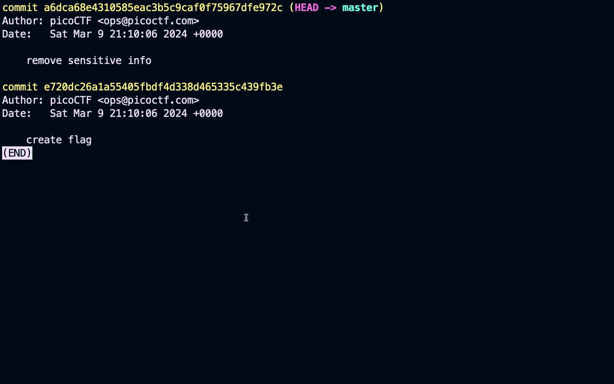
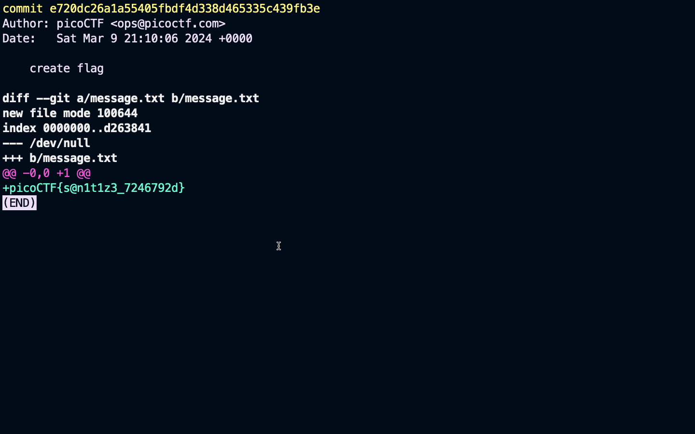
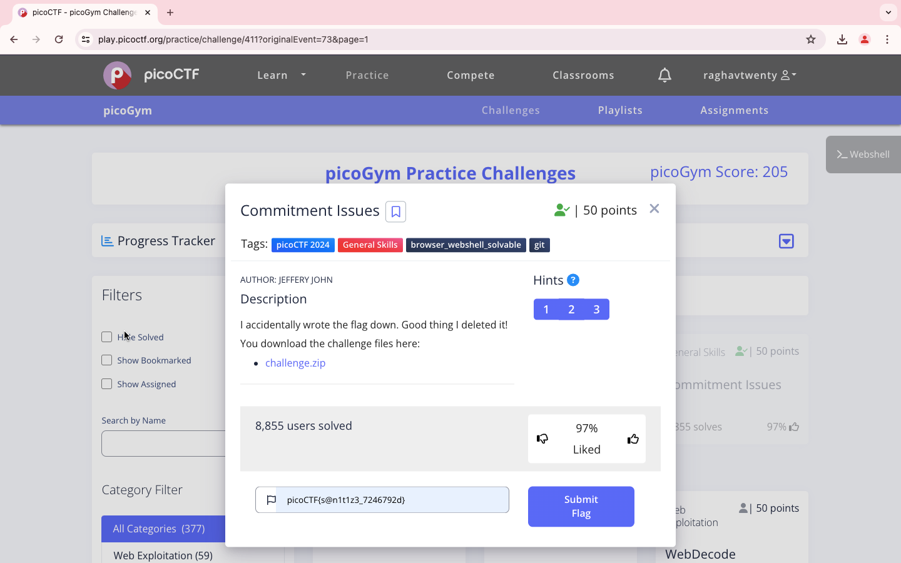

### Points

50

<br>

### Description

I accidentally wrote the flag down. Good thing I deleted it!
You download the challenge files here:
```
https://artifacts.picoctf.net/c_titan/76/challenge.zip
```

<br>

### Solution

1. It's a git initialized folder


2. Check the previous commit history using
```
git log
```

3. Copy the first log hash


4. To view the changes made in previous commit use
```
git show e720dc26a1a55405fbdf4d338d465335c439fb3e
```

5. The flag is here


```
picoCTF{s@n1t1z3_7246792d}
```

<br>

WHOA !!!

<br>

