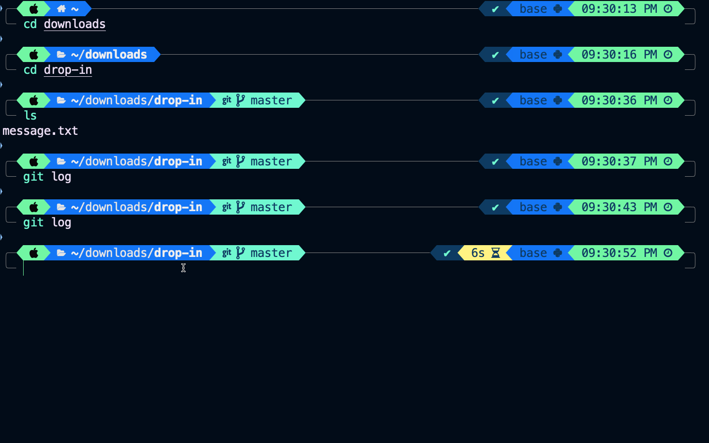
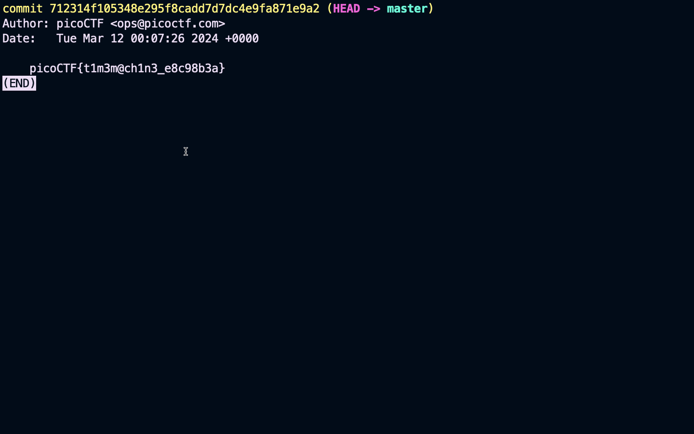
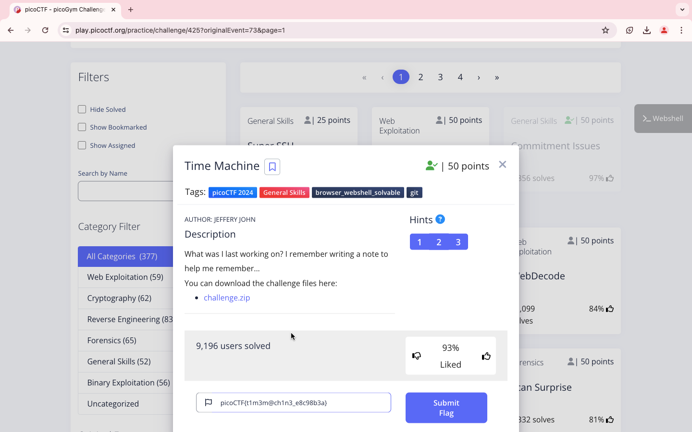

### Points

50

<br>

### Description

What was I last working on? I remember writing a note to help me remember...
You can download the challenge files here:
```
https://artifacts.picoctf.net/c_titan/162/challenge.zip
```

<br>

### Solution

1. It's a git initialized folder


2. Check the previous commit history using
```
git log
```

3. The flag is here


```
picoCTF{t1m3m@ch1n3_e8c98b3a}
```

<br>

WHOA !!!

<br>

