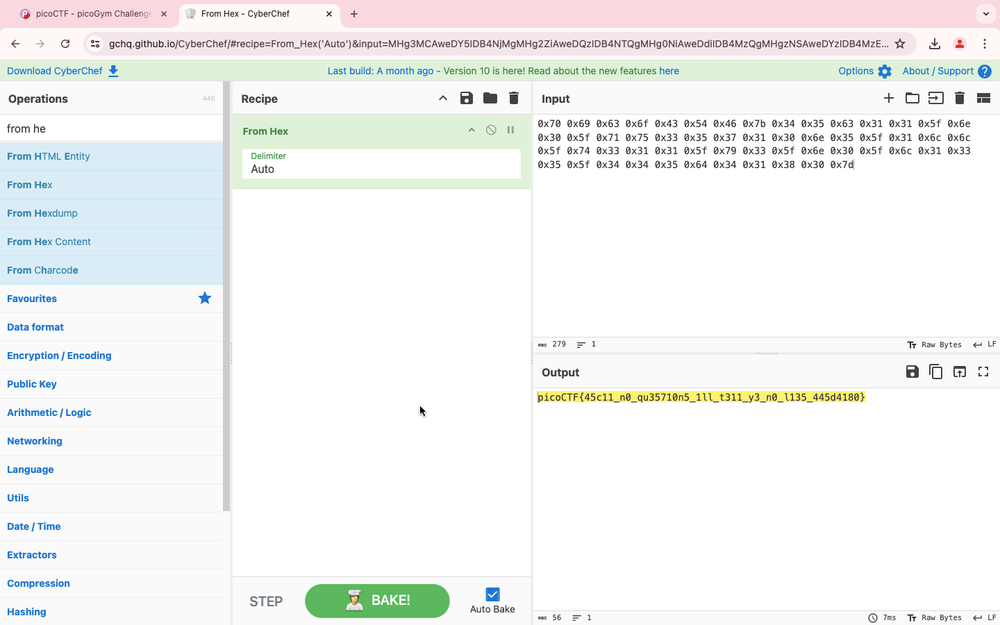
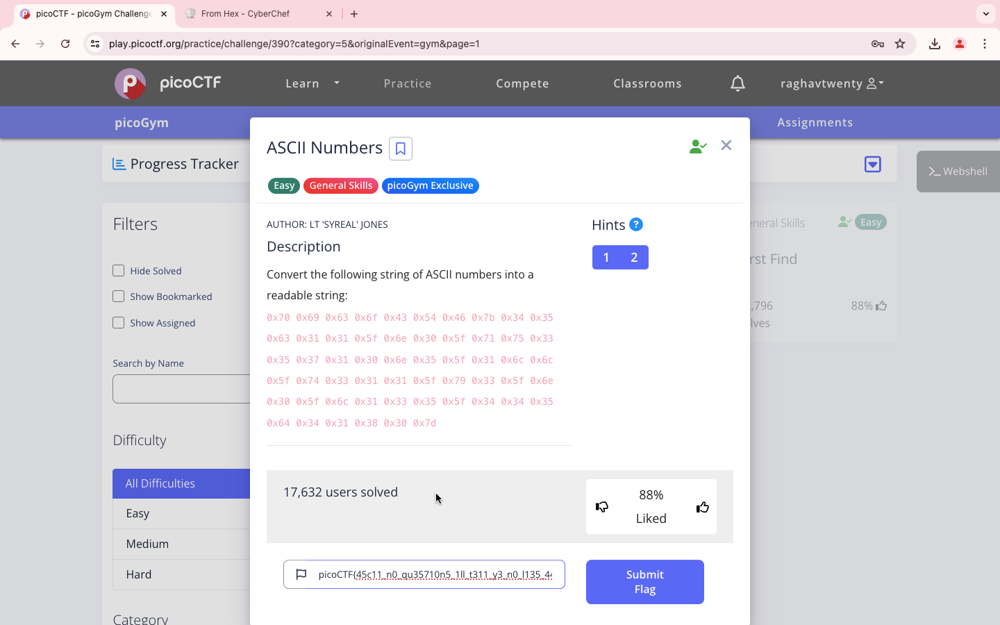

### Title

ASCII Numbers
<br><br>


### Category

General Skills
<br><br>


### Description

Convert the following string of ASCII numbers into a readable string
<br><br>


### Solution

1. The string 

```
0x70 0x69 0x63 0x6f 0x43 0x54 0x46 0x7b 0x34 0x35 0x63 0x31 0x31 0x5f 0x6e 0x30 0x5f 0x71 0x75 0x33 0x35 0x37 0x31 0x30 0x6e 0x35 0x5f 0x31 0x6c 0x6c 0x5f 0x74 0x33 0x31 0x31 0x5f 0x79 0x33 0x5f 0x6e 0x30 0x5f 0x6c 0x31 0x33 0x35 0x5f 0x34 0x34 0x35 0x64 0x34 0x31 0x38 0x30 0x7d
```

2. Use CyberChef and choose from "From Hex"




3. It's  45c11_n0_qu35710n5_1tt_t311_y3_n0_l135_
445d4180

```
picoCTF{45c11_n0_qu35710n5_1tt_t311_y3_n0_l135_
445d4180}
```
<br><br>


WHOA !!!
<br><br>

