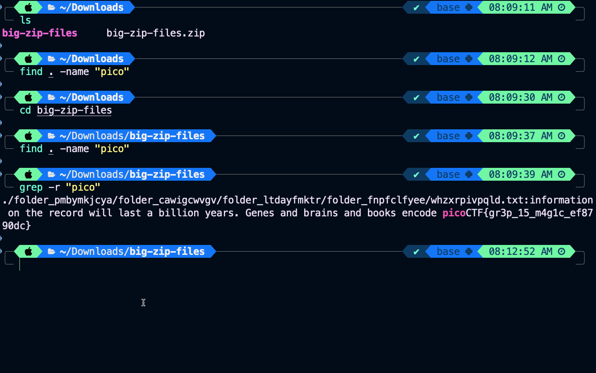
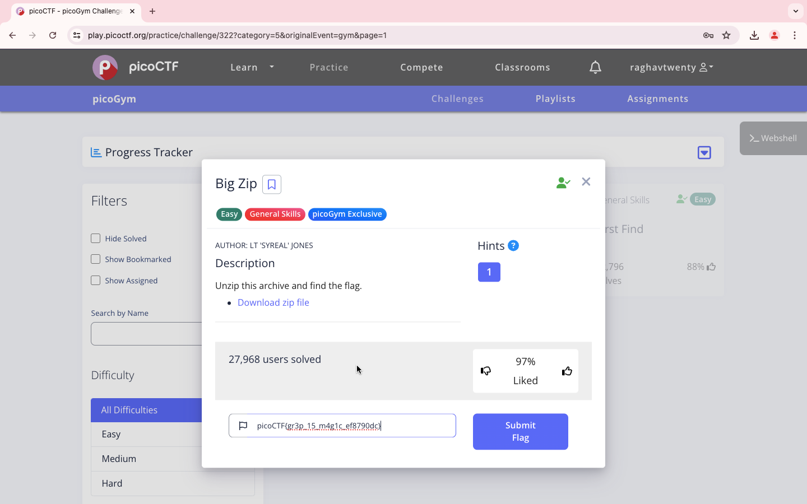

### Title

Big Zip
<br><br>


### Category

General Skills
<br><br>


### Description

Unzip this archive and find the flag.<br>
Download zip file
<br><br>


### Solution

1. Download and unzip the file

2. Use the command

```
grep -r "pico"
```


3. It's  gr3p_15_m4g1c_ef8790dc

```
picoCTF{gr3p_15_m4g1c_ef8790dc}
```
<br><br>


WHOA !!!
<br><br>

