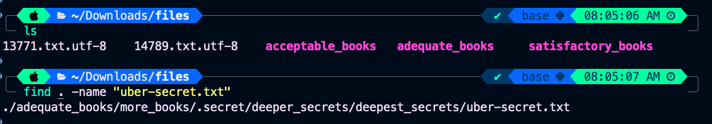
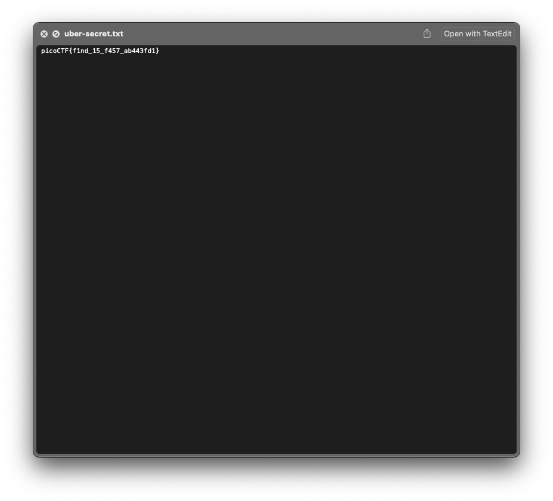
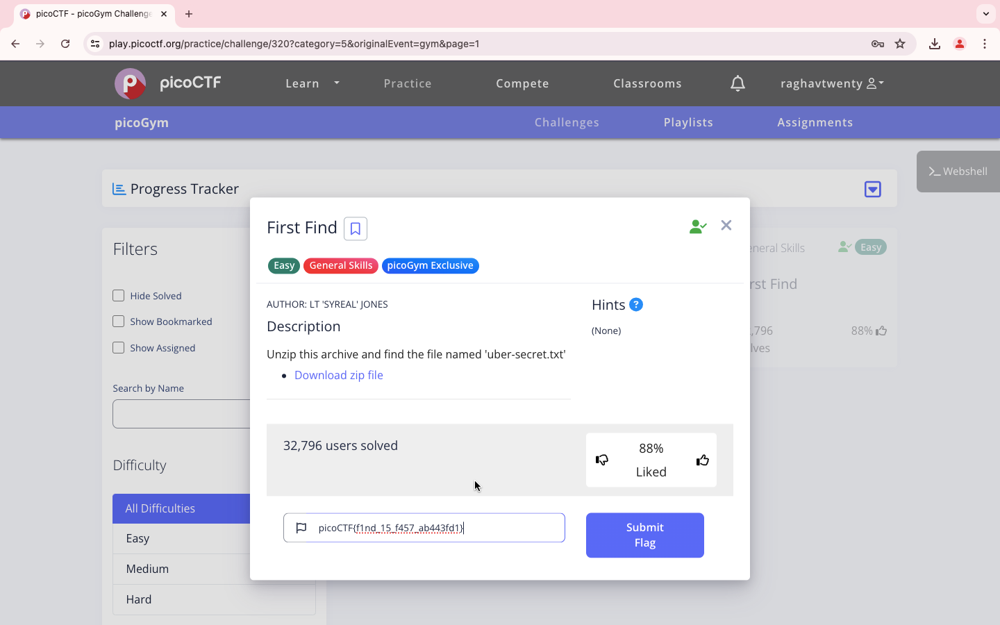

### Title

First Find
<br><br>


### Category

General Skills
<br><br>


### Description

Unzip this archive and find the file named 'uber-secret.txt' <br>
Download zip file
<br><br>


### Solution

1. Download and unzip the file

2. Use the command

```
find -name "uber-secret.txt"
```



3. View the file ./adequate books/more books/.secret/deeper secrets/deepest secrets/uber-secret.txt



4. It's f1nd_15_f457_ab443fd1

```
picoCTF{f1nd_15_f457_ab443fd1}
```
<br><br>


WHOA !!!
<br><br>

